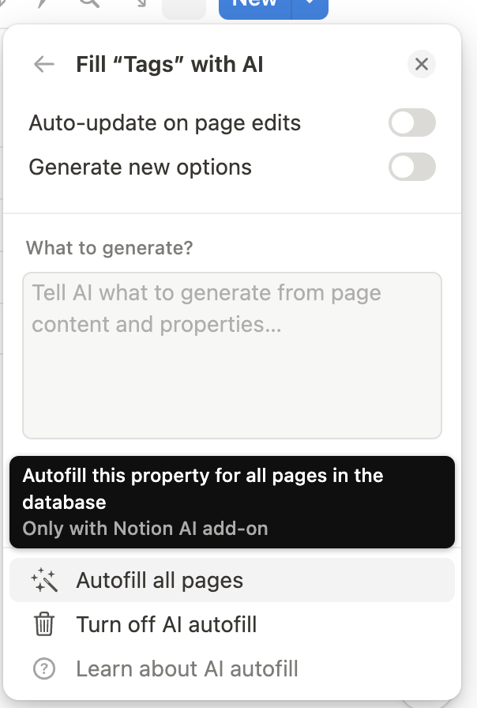

# notion-journal-tagger

First, I disabled Notion's AI features. They're awfully invasive, and they have the gall to charge extra for them despite me paying Notion to essentially store my data & barely iterate on their product. 🤮.

There's one feature they have for using AI to automatically tag pages. This is really useful for things like journals where you want to write entries frequently, and not worry about tagging them properly; but then you also want tags to be able to sort them effectively.



ergo, I implemented it myself.

# Usage

Requirements (you can see this in the .env.example file)
* Knowledge to run `python` scripts & setup a venv
* An OpenAI API key
* Notion API key (private integration)
* Get your Notion database ID that you want to tag pages on. You can get this by opening your database in a full page, pressing CMD L (or ctrl L) to get a link to the page, and then trimming to just get the numeric portion. I also wrote a helper function, `extract_notion_id` in `scripts.py` if you're so inclined.
* Come up with your list of tags
* Come up with additional context that would be relevant for your journal entry

Once you have these things, put them in the `.env` file.

Then, you can invoke the script(s) as follows:

```sh
python3 main.py 1 [YYYY-MM-DD]
python3 main.py 2
python3 main.py 3
python3 main.py 4
```

The phases all checkpoint (save files locally) in case something goes wrong, so you can rerun failed stages. The phases are as follows:

1. Get all the pageIDs within the DB. If you add in the optional date, it'll only get pageIDs for dates >= that (though it assumes you have a field called "Written on"
2. Get all the contents for every page. This is only text & bullet points
3. Ask ChatGPT 4o what it will label the page. This is using the new structured outputs model
4. Write these new tags -> Notion. This is an overwrite.
